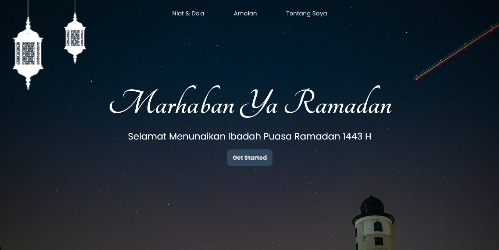

# Marhaban Ya Ramadan Page

Ini merupakan rancangan desain web yang saya buat sendiri khusus edisi menyambut Ramadan 1443 H. Berisikan niat berpuasa Ramadan dan do'a berbuka puasa. Menerima masukan dan saran agar saya dapat meningkatkan keahlian saya pribadi. Terima Kasih.

## Daftar Isi

- [Screenshot](#screenshot)
- [Live Site Link](#live-site-link)
- [Proses](#proses)
  - [Dibuat Dengan](#dibuat-dengan)
  - [Sumber Referensi](#sumber-referensi)
- [Author](#author)

### Screenshot

### Live Site Link

- Live Site URL: [Click Here](https://naufalf25.github.io/Marhaban-Ya-Ramadan-Page/)

## Proses

### Dibuat Dengan

- HTML5
- CSS3
- Vanila JS
- AJAX

### Sumber Referensi

- [Stack Overflow](https://stackoverflow.com/)

## Author

- Instagram - [@naufal_railfans25](https://www.instagram.com/naufal_railfans25/)
- Linkedin - [Muhammad-Naufal-Farras](https://www.linkedin.com/in/muhammad-naufal-farras-2605a2200/)
